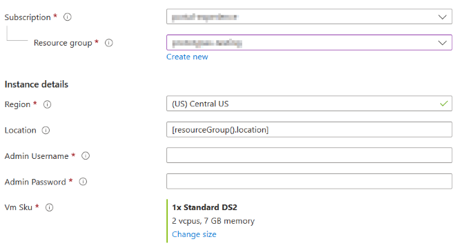
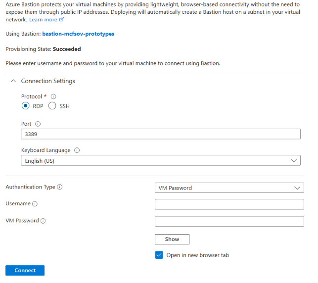
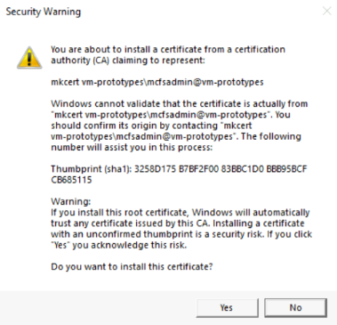
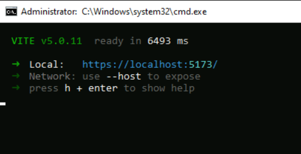

# Microsoft Cloud for Sovereignty Lifecycle ToolsPREVIEW

This is a brief introduction to our latest landing zone lifecycle management tools. Our aim is to enhance efficiency, reliability, and compliance features continually, aligning with evolving customer needs. We welcome feedback on these tools, which include:

- [Landing Zone Drift AnalyzerPREVIEW](#Drift-Analyzer): This tool monitors and compares the current state of the cloud environment with its original intended landing zone configuration, identifying critical deviations or changes.
- [AssessmentPREVIEW](#Assessment): This tool performs a pre-deployment evaluation of Azure resources against Microsoft Cloud for Sovereignty standard practices, including the evaluation of resource locations and Azure policy assignments.
- [Policy CompilerPREVIEW](#Policy-Compiler): This tool streamlines the policy management process. It systematically analyzes your organization's policy initiatives by examining key components.

## Preview Notice
**Preview Terms**. Landing Zone Drift AnalyzerPREVIEW, AssessmentPREVIEW, and Policy CompilerPREVIEW (collectively, "Microsoft Cloud for Sovereignty Lifecycle ToolsPREVIEW" or the "Preview") is licensed to you as part of your [Azure subscription](https://azure.microsoft.com/support/legal/) and subject to terms applicable to "Previews" as detailed in the Universal License Terms for Online Services section of the <u></u>Microsoft Product Terms and the [Microsoft Products and Services Data Protection Addendum ("DPA")](https://www.microsoft.com/licensing/terms/welcome/welcomepage). AS STATED IN THOSE TERMS, PREVIEWS ARE PROVIDED "AS-IS," "WITH ALL FAULTS," AND "AS AVAILABLE," AND ARE EXCLUDED FROM THE SERVICE LEVEL AGREEMENTS AND LIMITED WARRANTY. MICROSOFT MAKES NO WARRANTY THAT THE DATA AND CONTENT PROVIDED AS PART OF THE PREVIEW IS ACCURATE, UP-TO-DATE, OR COMPLETE. THE PREVIEW (1) IS NOT DESIGNED, INTENDED, OR MADE AVAILABLE AS LEGAL SERVICES, AND (2) IS NOT INTENDED TO SUBSTITUTE FOR PROFESSIONAL LEGAL COUNSEL OR JUDGMENT. THE DATA AND CONTENT PROVIDED THROUGH THE PREVIEW SHOULD NOT BE USED IN PLACE OF CONSULTING WITH A QUALIFIED PROFESSIONAL LEGAL PROFESSIONAL FOR YOUR SPECIFIC NEEDS. Previews may employ lesser or different privacy and security measures than those typically present in Azure Services. Unless otherwise noted, you should not use Previews to process Personal Data or other data that is subject to legal or regulatory compliance requirements. The following terms in the [DPA](https://www.microsoft.com/licensing/docs/view/Microsoft-Products-and-Services-Data-Protection-Addendum-DPA) do not apply to Previews: Processing of Personal Data; GDPR, Data Security, and HIPAA Business Associate. We may change or discontinue Previews at any time without notice. We also may choose not to release a Preview into General Availability.

**Confidentiality**.  The Preview and any associated materials or documentation are confidential information and subject to your existing confidentiality obligations with Microsoft. In the event that your existing confidentiality obligations are detailed in an agreement with a Microsoft Corporation Affiliate ("Affiliate Agreement"), for the purpose of this Preview, such obligations will apply as if Microsoft Corporation were a party to such Affiliate Agreement.

# How to Access the Microsoft Cloud for Sovereignty Lifecycle ToolsPREVIEW

To access the Microsoft Cloud for Sovereignty Lifecycle ToolsPREVIEW we have created a template that will deploy the following components into a resource group in your Azure tenant:
- Virtual Machine
- Virtual Network & Subnets
- Network Security Group
- Public IP (Bastion)
- Bastion Host

Once these components have been deployed the Microsoft Cloud for Sovereignty Lifecycle ToolsPREVIEW application will be installed and configured on the virtual machine. To get started click the "Deploy to Azure" button below.

You will need to fill out the following in order to start the deployment:
- Subscription
- Resource Group
- Location (by default this will use the resource group location)
- Admin Username (Username for the virtual machine)
- Password
- Virtual Machine size

Once those have been filled out click ``Review + create``. After the deployment is finished navigate to the resource group you selected. Click ``vm-prototypes``, in the top bar click ``Connect`` and choose ``Connect via Bastion``. Enter the Username and Password you created at deployment and click ``Connect``. 

A new tab will open and connect you to the virtual machine.

## Post Deployment Configuration

Navigate to ``"C:\Microsoft Cloud for Sovereignty Prototypes\"`` directory and run the ``Launch.bat`` file.

On first run the application will download and install dependencies. During this process you may see a window asking if you want to import a certificate, Click Yes. 

Once this process has completed the console window will display the url where the Microsoft Cloud for Sovereignty Lifecycle ToolsPREVIEW Application is running. Close both console windows. In the ``"C:\Microsoft Cloud for Sovereignty Prototypes\"`` directory you will need to run ``FixCerts.ps1`` from an elevated Powershell window in order to remove all certificate warnings and errors.

After running ``FixCerts.ps1`` navigate to ``"C:\Microsoft Cloud for Sovereignty Prototypes\"`` directory and run the ``Launch.bat`` again. Once the application is running you may navigate to the displayed URL using a browser.

# Landing Zone Drift AnalyzerPREVIEW

The Landing Zone Drift AnalyzerPREVIEW tool monitors and compares the current state of the cloud environment with its original intended configuration, identifying critical deviations or changes. These deviations, whether intentional or unintentional, are essential indicators of environmental integrity and compliance. 

### Landing Zone Drift AnalyzerPREVIEW access information

For access, a public preview is available for users to check drift against a standard SLZ configuration. Additionally, you can request the private preview [here](https://aka.ms/Cloud4SovPreview), which lets you check the drift against a registered landing zone. 

Important: The public preview of Landing Zone Drift AnalyzerPREVIEW offers limited functionality compared to the private preview.

### Classifications

The Landing Zone Drift AnalyzerPREVIEW compares the current state of the cloud environment with its original intended configuration and identifies critical deviations or changes. You can classify these deviations, whether intentional or unintentional,  as follows:
- Severity: Classifying the impact of changes by severity levels helps prioritize actions. 
- Management Groups: Changes to management groups might result in security and compliance risks.  
- Policy Initiative assignments: Modifications to policy assignments can cause operational risks. 
- Policy parameters: Modifications to policy parameters can cause operational risks.
- Allowed locations: Changes to allowed locations can compromise security or compliance. 
- Log retention: Changes to log retention policies risk can data loss or non-compliance.  
- Severity changes: Changes to severity levels might lead to missed critical change notifications. 
- Management Group hierarchy: Changes to management group hierarchies can increase security risks. 

### Running the Landing Zone Drift AnalyzerPREVIEW

Select a landing zone registration OR a landing zone configuration and management group below. If you select a registration then the registration will contain the landing zone configuration and management group hierarchy to compare. If you do not have a landing zone registration then you can manually select an existing landing zone configuration and root of a management group hierarchy to compare.

# AssessmentPREVIEW

The AssessmentPREVIEW tool provides a pre-deployment evaluation of Azure resources against Microsoft Cloud for Sovereignty standard practices, including the evaluation of resource locations and Azure policy assignments. The tool assesses various aspects of a cloud environment, such as the Sovereign Landing Zone (SLZ) Baseline Policy assignment, Custom Policy Initiatives usage, and individual policy assignments, offering recommendations categorized as good, better, or best based on severity findings.

- Best: Assignment of the SLZ Baseline Policy Initiative
- Better: Assignment of policies from the SLZ baseline in a custom initiative or another built-in initiative
- Good: Individual assignments of policies that are a part of the SLZ Baseline Policy Initiative

The tool evaluates each category  and gives severity levels based on findings.

### Categories
- Allowed Locations
- Confidential Computing (if selected at time of assessment)
- Customer-Managed Keys
- Architecture

### Severity Levels

The tool groups the findings of category evaluations  by the following severity levels: 

| **Severity**  | **Finding**                                                    |
|---------------|----------------------------------------------------------------|
| High          | Policy is not found                                            |
| Medium        | Policy is assigned individually                                |
| Low           | Policy is assigned as part of an initiative (Not the baseline) |
| Informational | Management Groups are not being used                           |
| None          | No finding if Baseline Policy set is assigned                  |

### Resource Residency

The Resource Residency section of the tool displays essential details of all resources within the selected subscription, including Resource Location, Resource Name, and Resource ID, facilitating a comprehensive view of resource distribution within the environment. 

### Running AssessmentPREVIEW

Select a subscription and click analyze to assess your current environment against a set of Microsoft Cloud for Sovereignty standard practices.
Check the "Assess Confidential Computing" checkbox if you expect to enforce the use of confidential computing technologies in your subscription.

# Policy CompilerPREVIEW

In the complex landscape of regulatory compliance, organizations face the challenging task of managing overlapping and sometimes conflicting policy initiatives. The Policy CompilerPREVIEW tool streamlines the policy management process. It systematically analyzes your organization's policy initiatives by examining key components—such as display names, descriptions, parameters, and effects. By comparing these elements across different policies, the tool detects redundancies, conflicts, and gaps. It then uses this analysis to provide a set of recommended, reconciled policy initiatives that align with customers’ specific compliance needs, making policy management more efficient and reliable.

 ### Use case example

Imagine Policy CompilerPREVIEW as a dedicated assistant who meticulously reviews all your policy documents, identifies any overlaps or contradictions, and then advises you on the best course of action. Whether it's harmonizing data protection policies across different jurisdictions or aligning security measures with varying industry standards, Policy Compiler assists in creating a cohesive and clear policy framework. 

### Policy CompilerPREVIEW updates for the early preview release

The current prototype of the Policy CompilerPREVIEW tool provides users with access to all built-in and custom Azure policy initiatives at their root scope.  This tool allows users to consolidate all unique policies from selected initiatives into a single custom initiative, offering a comprehensive overview and simplification of their policy landscape. 

### Running the Policy CompilerPREVIEW

*NOTE: The first policy set selected will be used as the primary policy set for comparison.*

- Most Restrictive (default if no option selected) - When compiling all initiatives into a singular custom initiative, the default initiative parameter value for policy effects will be the most restrictive default value (such as Deny) used by any of the initiatives.
- Least Restrictive - When compiling all initiatives into a singular custom initiative, the default initiative parameter value for policy effects will be the least restrictive default value (such as Audit) used by any of the initiatives.
- Delta - Will generate a custom initiative that contains all policies and their respective groupings and parameters that are not found in the primary initiative.