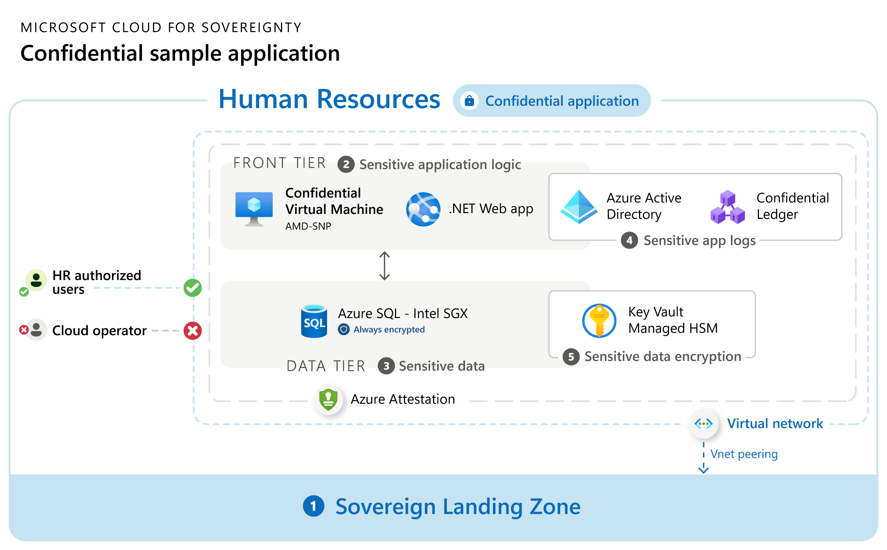

# Application architecture

The sovereign application is deployed in a confidential Sovereign Landing Zone environment, specifically in the *Confidential Online* Management Group. To learn more about SLZ architecture and the Management Groups, see [Architecture of the Sovereign Landing Zone (SLZ) Preview](https://github.com/Azure/sovereign-landing-zone/blob/main/docs/02-Architecture.md).

## Azure capabilities in application architecture

The application architecture implements the following Azure capabilities on a three-tier architecture:

1. **Sovereign Landing Zone** - [The Sovereign Landing Zone (SLZ)](https://github.com/Azure/sovereign-landing-zone/blob/main/docs/01-Overview.md) is the recommended framework to secure deployment of workloads.

1. **Sensitive Application Logic** - [Azure Confidential VM - with AMD SEV-SNP](https://learn.microsoft.com/azure/confidential-computing/virtual-machine-solutions-amd): Used for hosting an ASP.NET web app that queries the `HR` Azure SQL DB using the [ADO.NET driver](https://docs.microsoft.com/sql/connect/ado-net/microsoft-ado-net-sql-server?view=azuresqldb-current) and Azure [Confidential ledger client library for .NET](https://learn.microsoft.com/en-us/dotnet/api/overview/azure/security.confidentialledger-readme?view=azure-dotnet) to persist Sensitive Logs generated on the web app (in this case, query history). This capability is the `FRONT TIER` in architecture diagram.

1. **Sensitive Data** - [Azure SQL DB - Always Encrypted with secure enclaves](https://docs.microsoft.com/azure/azure-sql/database/always-encrypted-with-secure-enclaves-landing). For a sovereign confidential `HR` database, the `SSN` and `Salary` columns are encrypted using the Column Master Key ([`CMK`](https://learn.microsoft.com/sql/relational-databases/security/encryption/configure-always-encrypted-keys-using-ssms?view=sql-server-ver16)). This capability is the `DATA TIER` in architecture diagram.

1. **Sensitive Application logs** - [Azure Confidential Ledger](https://docs.microsoft.com/azure/confidential-ledger/). This capability is an append-only, immutable ledger [CCF](https://microsoft.github.io/CCF/main/overview/what_is_ccf.html) for hosting Sensitive Logs. We have created a [Confidential Ledger Client](../../contosoHR/ConfidentialLedgerClient/README.md) to read the confidential logs.

1. **Sensitive Data Encryption** - [**Azure Key Vault**](https://learn.microsoft.com/azure/key-vault/general/overview) or [**Managed HSM**](https://docs.microsoft.com/azure/key-vault/managed-hsm/overview): Azure Key Vault or Managed HSM is the service that provides secure key management and cryptographic operations for sensitive data and applications. Managed HSM uses Hardware Security Modules (HSMs) to protect and manage cryptographic keys and secrets. A FIPS 140-2 Level 3 validated HSM is used in this case for storing the [Always Encrypted Column Master Key](https://docs.microsoft.com/sql/relational-databases/security/encryption/create-and-store-column-master-keys-always-encrypted?view=sql-server-ver16) - or `CMK` for `HR` Database.

## Current architecture

## Next step

* Continue with [Prerequisites](03-prerequisites.md)
